# How to add a pairing custom field in Azure DevOps User Stories

This document outlines the benefits of adding a custom field of type _Identity_ in [Azure DevOps](https://docs.microsoft.com/en-us/azure/devops/user-guide/what-is-azure-devops) (Azure DevOps) user stories, prerequisites, and a step-by-step guide.

## Benefits of adding a custom field

Having the names of both individuals [pairing on a story](./readme.md) visible on the Azure DevOps cards can be helpful during sprint ceremonies and lead to greater accountability by the pairing assignee. For example, it is easier to keep track of the individuals assigned stories as part of a pair during sprint planning by using the "pairing names" field. During stand-up it can also help the Process Lead filter stories assigned to the individual (both as an owner or as a pairing assignee) and show these on the board. Furthermore, the pairing field can provide an additional data point for reports and burndown rates.

## Prerequisites

Prior to customizing Azure DevOps, review [Configure and customize Azure Boards](https://docs.microsoft.com/en-us/azure/devops/boards/configure-customize).

In order to add a custom field to user stories in Azure DevOps changes must be made as an **Organizational setting**. This document therefore assumes use of an existing Organization in Azure DevOps and that the user account used to make these changes is a member of the [Project Collection Administrators Group](https://docs.microsoft.com/en-us/azure/devops/organizations/security/set-project-collection-level-permissions).

## Step-by-step to change the organization settings

1. Duplicate the process currently in use.

    Navigate to the **Organization Settings**, within the Boards / Process tab.

    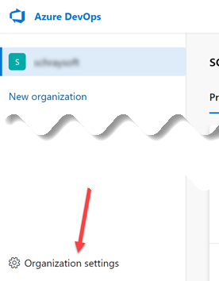

2. Select the **Process** type, click on the icon with three dots **...** and click **Create inherited process**.

    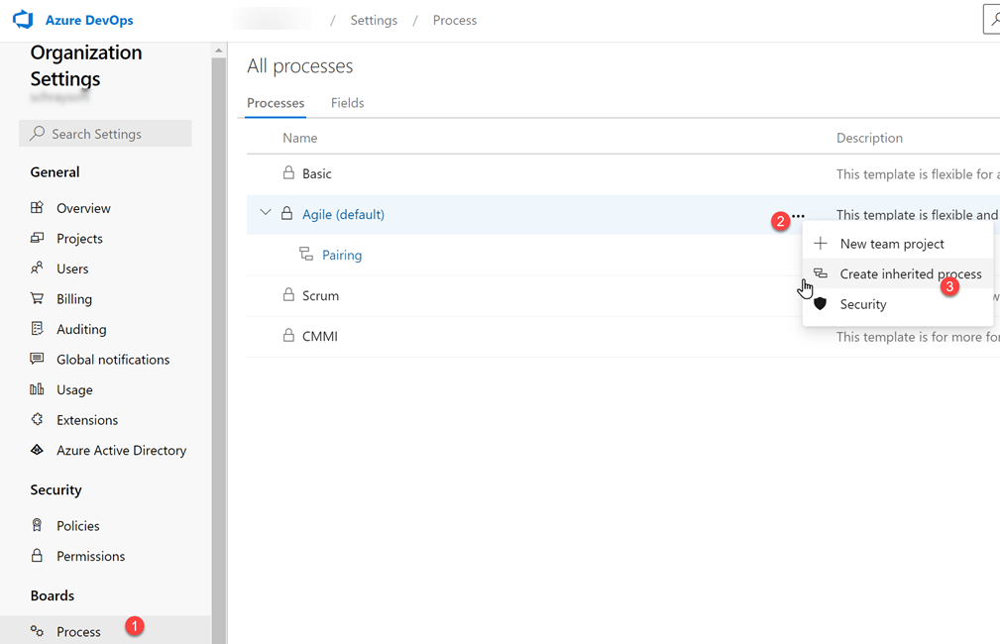

3. Click on the newly created inherited process.

    As you can see in the example below, we called it 'Pairing'.

    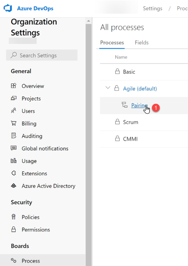

4. Click on the work item type **User Story**.

    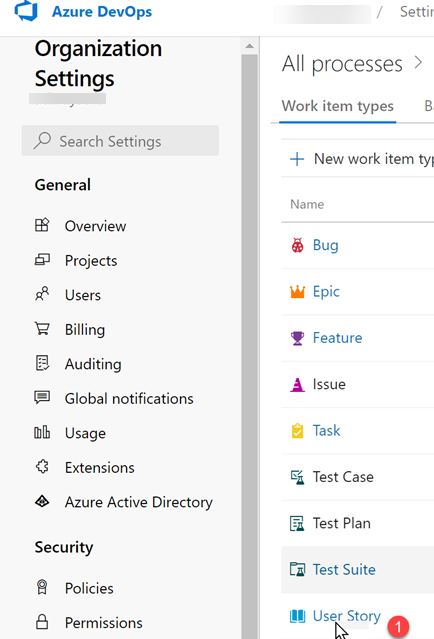

5. Click **New Field**.

    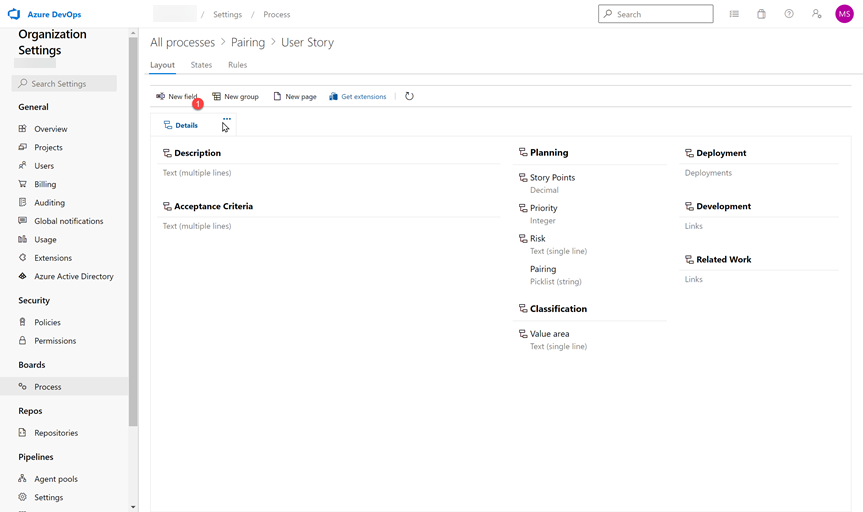

6. Give it a **Name** and select **Identity** in Type. Click on **Add Field**.

    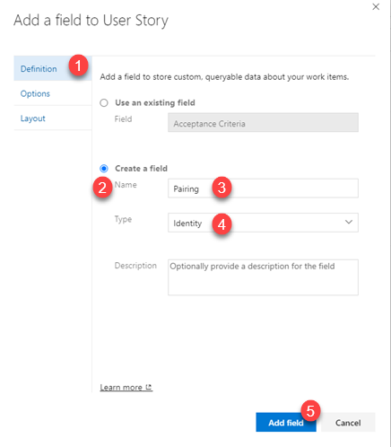

    This completes the change in Organization settings. The rest of the instructions must be completed under Project Settings.

## Next, change the project settings

1. Go to the Project that is to be modified, select **Project Settings**.

    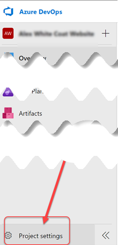

2. Select **Project configuration**.

    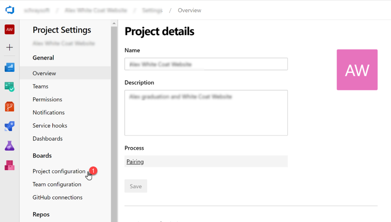

3. Click on **process customization page**.

    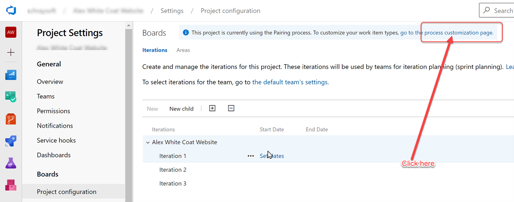

4. Click on **Projects** then click on **Change process**.

    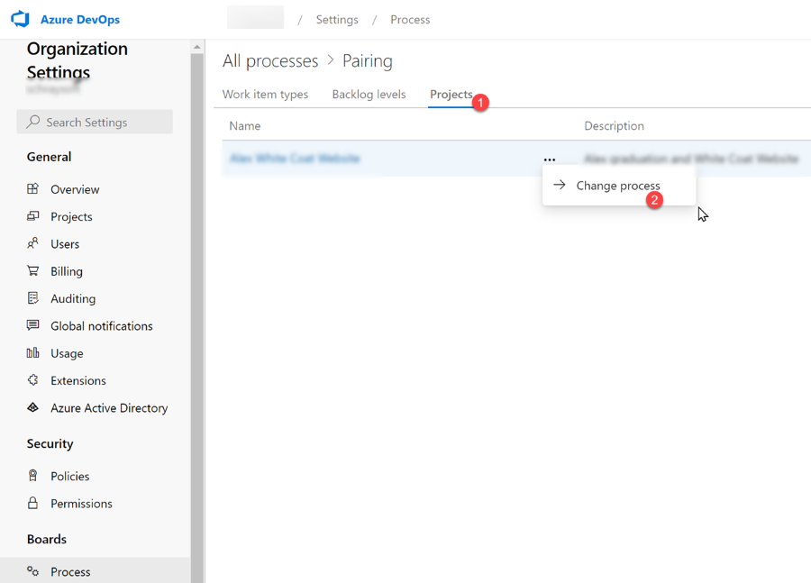

5. Change the **target process** to Pairing then click Save.

    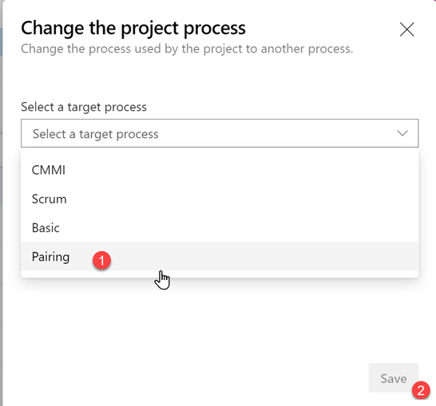

6. Go to **Boards**.

    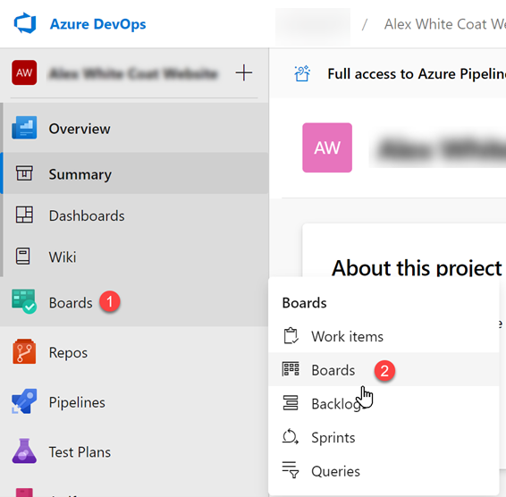

7. Click on the Gear icon to open Settings.

    

8. Add field to card.

    Click on the green + icon to add select the Pairing field. Check the box to display fields, even when they are empty. **Save and close**.

    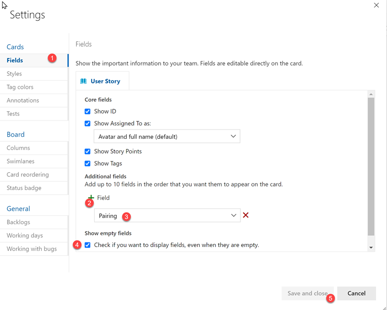

9. View the modified the card.

    Notice the new Pairing field. The Story can now be assigned an Owner and a Pairing assignee!

    
