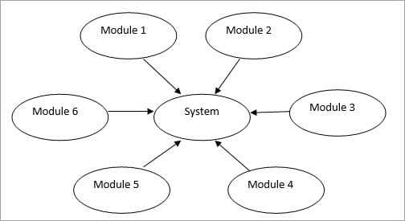
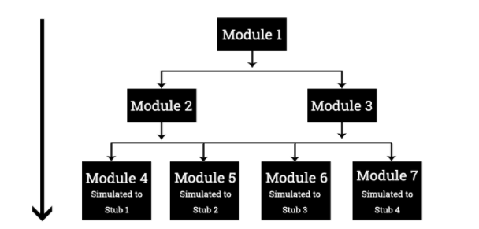
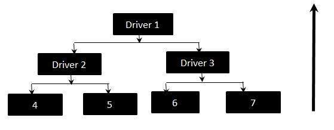

# Integration Testing

Integration testing is a software testing methodlogy that tests how well individually developed componenets of a system communicate wtih each other. This method of testing confirms that an aggregate of a system, or sub-system, works together correctly or otherwise exposes erroneous behavior between two or more units of code.

## Why Integration Testing

Beecause one component of a system may be developed independently or in isolation of another, it is important to verify the interaction of some or  all components. A complex system may be composed of databases, APIs, interfaces, and more, that all interact with each other or external systems. Integration tests expose system-level issues such as broken datatabse schemas or broken third-party API integration. It ensures higher test coverage and serves as an important feedback loop throughout development.

## Integration Testing Design Blocks

Consider a messaging application with three modules: a login page, messages page, and database, all developed indepdently. Integration tests would examine how a user's login page directs them to the correct messages page where teh user and only teh user's message populate the page in a readable, sortable format. Another inteegration tests may test a user sending a message and how it renders in the database. 

Integration testing is done by the developer or QA tester. In the past, integration testing always happened after unit and before system and E2E testing. Currently, if a team is following agile principles, integration tests can be performeed before or after unit tests as there is no need to wait for sequential processes. Integration tests can utilize mock data in order to simulate a complete system under test so they should be done early and often. Integration tests need not achieve 100% code coverage. Tests may be slower and require higher maintanence than unit tests. However, there is an abundace of language-specific testing frameworks that can be used throughout the entire development lifecycle.  

** It is important to note the difference between integration and acceptance testing. Integration testing confirms a group of components work together as intended from a technical persepctive, while acceptance testing confirms a group of components work together as intended from a business scenario.

## Applying Integration Testing

Prior to writing integration tests the teser must identify the different components of the system and their intended behaviors. The engineer must fully understand the achitecture of the system.

There are two main tehcniques for integration testing.

### Big Bang
Big Bang integration teseting is when all components are tested as a single unit. This is best for small system as a system too large may be difficult to localize for potential errors from faild tests. This approach also requires all components in the system under test to be completed which s may delay when testing begins.

### Incremental Testing
Incremental testing is when two or more components that are logically related are tested as a unit. After testing the unit, additional components are combined and tested all together. This process repeats until all componenets are tested.

#### Top Down
Top down testing is when higher level components are tested following the control flow of a software system. In the scenario, what is commonly reffered to as stubs are used to emulate the behavior of lower level modules not yet complete or integrated with the integration test.

#### Bottom Up
Bottom up testing is when lower level modules are tested together. In the scenario, what is commonly reffered to as drivers are used to emulate the behavior of higher level modules not yet complete or integrated with the integration test.

A third appraoch sometimes known as the sandwich or hybrid model, combines the bottom up and town down appraoches to test lower and higher level components at the same time.

### Things to Avoid

There is a tradeoff a developer must evaluate between integration test code coverage and engineering cycles. With mock dependencies, test data, and separate environments to test, too many integration tests are infeasible to maintain with a low return in efficacy. Too much mocking will slow down the test suite, make scaling difficult, and may be a sign the developer should consider other tests for the scenario such as acceptance or E2E.

Integration tests of complex systems require high maintanence. Avoid testing business logic in integration tests by keeping test suites separate. Avoid writing tests in a scaled-down copy of the production environment, instead write them in a copy. Additionally, avoid tesing beyond the acceptance criteria of the task and avoid overlaping functionality with other test suites. Avoid leaving artifacts.

Avoid skipping integration tests!

## Integration Testing Frameworks and Tools

JUnit can be used for both integration and unit testing. It is supported by almost all major IDEs.
REST Assured
Spock
Cucumber. Automated
Robot Frameowrk
Mockito
Spock
Rational Integration Tester
Protractor
Steam
TESSY

## Conclusion

Integration testing examines how one module of a system interfaces with another. This can be a test of two components, a sub-system, a whole system, or a collection of systems.

Because integration tests prove the system as a whole works as technically designed, it increases confidence in the development cycle allowing for a system that deploys and scales.

## Resources

List additional readings about this test type for those that would like to dive deeper.
